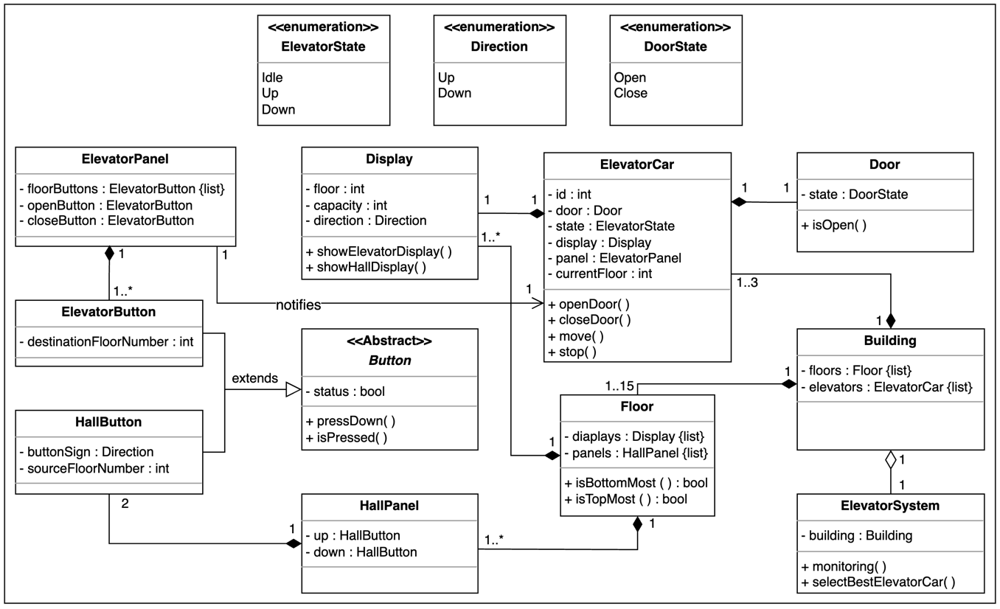

## Requirement collection

For the elevator design problem, the requirements are defined below:

**R1:** There exist multiple elevator cars and floors in the building.

**R2:** The building can have a maximum of 15 floors and three elevators.

**R3:** The elevator car can move up or down or be in an idle state.

**R4:** The elevator door can only be opened when it is in an idle state.

**R5:** Every elevator car passes through each floor.

**R6:** The panel outside the elevator should have buttons to call an elevator car and to specify whether the passenger wants to go up or down.

**R7:** The panel inside the elevator should have buttons to go to every floor. There should be buttons to open or close the lift doors.

**R8:** There should be a display inside and outside the elevator car to show the current floor number and direction of the elevator car.

**R9:** The display inside the elevator should also show the capacity of the elevator car.

**R10:** Each floor has a separate panel and a display for each elevator car.

**R11:** Multiple passengers can go to the same or different floors in the same or opposite direction.

**R12:** The elevator system should be able to control the elevator car movement and the door functioning and monitor the elevator car.

**R13:** The elevator control system should be able to send the most appropriate elevator to the passenger when the passenger calls the elevator car.

**R14:** The elevator car can carry a maximum of eight persons or 680 kilograms at once.


### Class Diagram




## **Core OOP Principles Used:**

### 1. **Encapsulation**

- **Private fields** with **public getter/setter methods**
- Example in `ElevatorCar`:

java

```java
private int id;
private Door door;
private ElevatorState state;

public int getId() { return id; }
public Door getDoor() { return door; }
```

### 2. **Abstraction**

- **Enums** abstract complex states: `ElevatorState`, `Direction`, `DoorState`
- **Method abstraction** hides complex logic:

java

```java
public void processSCANRequests() // Hides SCAN algorithm complexity
public ElevatorCar selectBestElevatorCar() // Hides selection logic
```

### 3. **Composition**

- **"Has-a" relationships** throughout the system:

java

```java
// ElevatorCar HAS-A Door, Display, List of Buttons
private Door door;
private Display display;
private List<ElevatorButton> panel;

// Building HAS-A list of Floors and Elevators
private List<Floor> floors;
private List<ElevatorCar> elevators;
```


## **Design Patterns Used:**

### 1. **Strategy Pattern** (Implicit)

- The **SCAN algorithm** is implemented as a strategy for elevator selection
- Could be extended to support different algorithms (FCFS, SSTF, etc.)

java

```java
private int calculateSCANDistance() // Strategy for distance calculation
public ElevatorCar selectBestElevatorCar() // Strategy for elevator selection
```

### 2. **State Pattern**

- **ElevatorState enum** manages elevator states: `IDLE`, `UP`, `DOWN`
- **DoorState enum** manages door states: `OPEN`, `CLOSE`
- State transitions are handled in methods like `move()`, `stop()`

### 3. **Composite Pattern**

- **Building** contains **Floors** and **ElevatorCars**
- **Floor** contains **Displays** and **HallButtons**
- **ElevatorCar** contains **Door**, **Display**, and **ElevatorButtons**

### 4. **Observer Pattern** (Framework for)

- **Display** class can show elevator status
- **Monitoring** method observes all elevator states
- Could be extended for real-time updates

### 5. **Command Pattern** (Implicit)

- **Requests** are encapsulated as objects with floor and direction
- **addRequest()** method stores commands for later execution

java

```java
public void addRequest(int floor, Direction direction)
```

### 6. **Singleton Pattern** (Potential)

- **ElevatorSystem** could be implemented as singleton for building-wide control
- **Building** represents a single building instance

## **Additional OOP Concepts:**

### 7. **Data Encapsulation with Collections**

java

```java
private Set<Integer> upRequests;
private Set<Integer> downRequests;
private List<ElevatorCar> elevators;
```

### 8. **Method Responsibility**

- Each class has **single responsibility**:
    - `Door`: Handle door operations
    - `Display`: Handle information display
    - `ElevatorCar`: Handle elevator movement and logic
    - `ElevatorSystem`: Handle system-wide coordination

