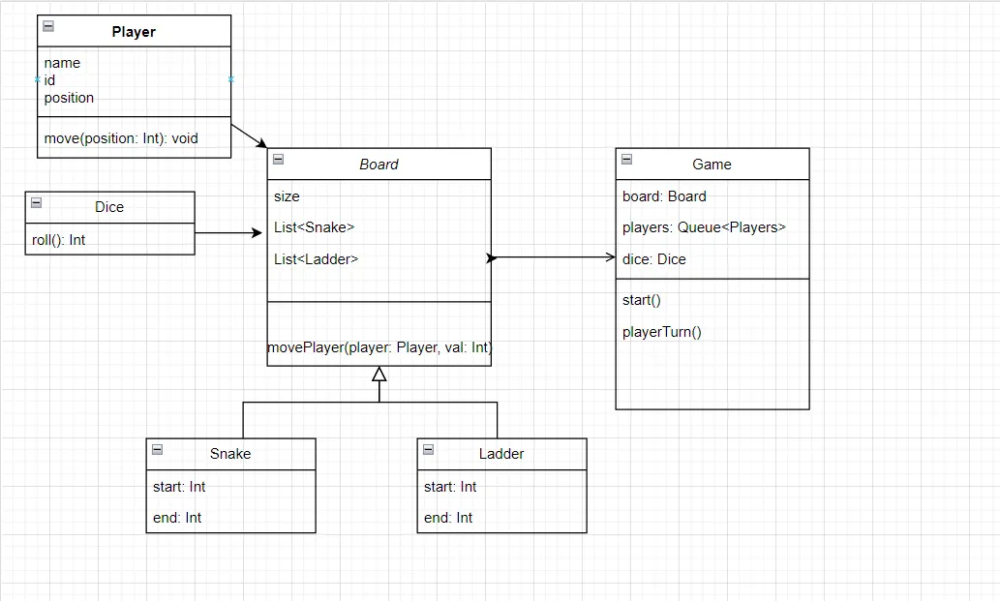

### Relationships

 -  Player → Board: Association (player interacts with board)
 -  Dice → Board: Association (dice results affect board state)
 -  Board → Game: Composition (board is part of game)
 -  Snake/Ladder → Board: Inheritance/Generalization (both inherit from a common base or are used by board)

